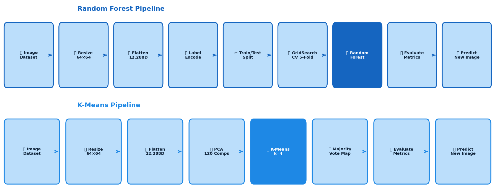

<div align="center">

# 🍅 Tomato Leaf Disease Detection
### A Comparative Study: Supervised vs Unsupervised Machine Learning

[](https://python.org)
[](https://scikit-learn.org)
[](https://opencv.org)
[](https://jupyter.org)
[](LICENSE)

<br/>

> **Automated detection of tomato leaf diseases using classical Machine Learning.**  
> Implements and rigorously compares a **Random Forest Classifier** (supervised) against **K-Means Clustering** (unsupervised), both enhanced with PCA dimensionality reduction.

<br/>

| 🌲 Random Forest | ⭕ K-Means Clustering | 📸 Dataset |
|:---:|:---:|:---:|
| **70.59%** Accuracy | **38.01%** Accuracy | **763** Images |
| Weighted F1: **0.69** | Weighted F1: **0.29** | **4** Disease Classes |
| PCA: 120 components | PCA: 120 components | 81.37% Variance Retained |

</div>

---

## 📋 Table of Contents

- [Overview](#-overview)
- [Results at a Glance](#-results-at-a-glance)
- [Dataset](#-dataset)
- [Project Architecture](#-project-architecture)
- [Algorithms Explained](#-algorithms-explained)
- [Installation & Usage](#-installation--usage)
- [Results Deep Dive](#-results-deep-dive)
- [Comparative Analysis](#-comparative-analysis)
- [Repository Structure](#-repository-structure)
- [Key Learnings](#-key-learnings)
- [Future Work](#-future-work)
- [Tech Stack](#-tech-stack)
- [Author](#-author)
- [References](#-references)

---

## 🔍 Overview

Plant diseases are a major cause of agricultural losses worldwide. **Tomato**, one of the most economically important crops globally, is vulnerable to several fungal and environmental pathogens. Early and accurate detection directly reduces crop loss, minimises pesticide usage, and enables timely farmer intervention.

This project answers a core Machine Learning research question:

> **"How much does labelled data matter? How does a supervised ensemble method compare to an unsupervised clustering approach on the same visual classification task?"**

Two fundamentally different ML paradigms are implemented on an identical preprocessing pipeline for a fair, controlled comparison:

| Approach | Algorithm | Paradigm | Requires Labels? |
|---|---|---|---|
| **Model A** | Random Forest + GridSearchCV | Supervised | ✅ Yes |
| **Model B** | K-Means + PCA | Unsupervised | ❌ No |

---

## 📊 Results at a Glance

<div align="center">

<br/>
<em>Figure 1: Overall accuracy — Random Forest vs K-Means vs 25% random baseline</em>
</div>

<br/>

<div align="center">

<br/>
<em>Figure 2: Per-class F1-score comparison across all four disease categories</em>
</div>

<br/>

### Summary Metrics

| Metric | Random Forest | K-Means |
|---|:---:|:---:|
| **Overall Accuracy** | **70.59%** | 38.01% |
| Macro Avg Precision | 0.70 | 0.44 |
| Macro Avg Recall | 0.67 | 0.34 |
| **Macro Avg F1** | **0.67** | 0.26 |
| **Weighted Avg F1** | **0.69** | 0.29 |
| Best Class F1 | Healthy: **0.84** | Healthy: 0.50 |
| Weakest Class F1 | Early Blight: 0.48 | Early Blight: 0.00 |

---

## 🗂️ Dataset

The dataset consists of **763 tomato leaf images** organised into 4 labelled class directories:

| Disease Class | Images | Share | Description |
|---|:---:|:---:|---|
| 🟤 **Tomato Early Blight** | 144 | 18.9% | *Alternaria solani* — dark concentric ring lesions on older leaves |
| 💧 **Tomato Late Blight** | 180 | 23.6% | *Phytophthora infestans* — water-soaked lesions, white sporulation |
| 🟡 **Tomato Leaf Mold** | 192 | 25.2% | *Passalora fulva* — yellow-green patches, olive-brown mold beneath |
| 🌿 **Tomato Healthy** | 247 | 32.4% | Disease-free reference class |
| | **763** | **100%** | |

> **Note:** The dataset exhibits mild class imbalance (Early Blight = 18.9%). Stratified train-test splitting was used in the Random Forest pipeline to preserve this distribution.

---

## 🏗️ Project Architecture

<div align="center">

<br/>
<em>Figure 3: End-to-end pipeline for both algorithms — highlighted boxes are the core ML steps</em>
</div>

<br/>

### Preprocessing Pipeline (Identical for both models)

```
Raw Image → Resize 64×64 → BGR→RGB → Flatten (12,288D) → Label Encode
                                                              ↓
                                          Random Forest ← Train/Test Split
                                          K-Means       ← PCA (120D, 81.37% variance)
```

---

## 🤖 Algorithms Explained

### 🌲 Model A: Random Forest Classifier

Random Forest (Breiman, 2001) is an ensemble learning method that constructs multiple decision trees and outputs the majority vote class. It is highly resistant to overfitting and naturally handles high-dimensional pixel feature vectors.

**Hyperparameter Optimisation via GridSearchCV (5-Fold CV):**

```python
param_grid = {
    'n_estimators': [50, 100, 200, 300],
    'max_depth':    [None, 10, 20],
    'min_samples_leaf':  [1, 2],
    'min_samples_split': [2, 5],
}
# Best: n_estimators=300, max_depth=20, min_samples_leaf=1, min_samples_split=2
# Grid evaluated 36 combinations × 5 folds = 180 total fits
```

### ⭕ Model B: K-Means Clustering + PCA

K-Means (MacQueen, 1967) partitions data into k clusters by minimising within-cluster Euclidean variance. It operates **entirely without labels** — making it a true unsupervised method. Post-hoc majority-vote mapping assigns disease labels to clusters.

**Why PCA before K-Means?**

Raw pixel vectors have **12,288 dimensions**. At this scale, all points appear equidistant (curse of dimensionality), making K-Means cluster separation impossible. PCA reduces this to **120 components retaining 81.37% of variance**.

```python
# PCA Configuration
pca = PCA(n_components=120, random_state=42)
data_pca = pca.fit_transform(data)
# Variance retained: 81.37%

# K-Means Configuration
kmeans = KMeans(
    n_clusters=4,       # = number of disease classes
    init='k-means++',   # smart initialisation
    n_init=10,          # best of 10 runs
    max_iter=300,
    random_state=42
)
```

**Cluster → Disease Mapping (Majority Vote):**
```
Cluster 0 → Tomato Leaf Mold
Cluster 1 → Tomato Healthy
Cluster 2 → Tomato Late Blight
Cluster 3 → Tomato Leaf Mold    ← Note: two clusters mapped to same class
```
> ⚠️ No cluster formed for Early Blight — a key indicator of non-spherical class boundaries in pixel feature space.

---

## 🚀 Installation & Usage

### Prerequisites

```bash
Python 3.10+
```

### 1. Clone the Repository

```bash
git clone https://github.com/your-username/tomato-disease-detection.git
cd tomato-disease-detection
```

### 2. Install Dependencies

```bash
pip install opencv-python numpy matplotlib seaborn pandas scikit-learn scipy
```

Or use the requirements file:

```bash
pip install -r requirements.txt
```

### 3. Prepare Dataset

Place your image dataset in the following structure:

```
Image Data base/
├── Tomato_Early_blight/
│   ├── image001.jpg
│   └── ...
├── Tomato_Late_blight/
├── Tomato_Leaf_Mold/
└── Tomato_healthy/
```

### 4. Run the Notebooks

**Random Forest Model:**
```bash
jupyter notebook Project.ipynb
```

**K-Means Model:**
```bash
jupyter notebook Project__K_Means_.ipynb
```

### 5. Predict on a New Image

```python
# Random Forest
result = predict_image_class("your_leaf.png", best_model)
print(f"Predicted: {result}")

# K-Means
result = predict_image_class_kmeans("your_leaf.png", kmeans, pca)
print(f"Predicted: {result}")
```

---

## 📈 Results Deep Dive

### Random Forest — Confusion Matrix & Classification Report

<div align="center">

<br/>
<em>Figure 4: Random Forest confusion matrix — Test Set (n=153)</em>
</div>

<br/>

| Class | Precision | Recall | F1-Score | Support |
|---|:---:|:---:|:---:|:---:|
| Tomato Early Blight | 0.57 | 0.41 | **0.48** | 29 |
| Tomato Late Blight | **0.82** | 0.50 | 0.62 | 36 |
| Tomato Leaf Mold | 0.62 | **0.87** | 0.73 | 38 |
| Tomato Healthy | 0.79 | **0.90** | **0.84** | 50 |
| **Macro Average** | 0.70 | 0.67 | 0.67 | 153 |
| **Weighted Average** | 0.71 | 0.71 | **0.69** | 153 |

**Key Observations:**
- ✅ **Healthy** — Highest recall (0.90): model reliably identifies disease-free leaves
- ✅ **Late Blight** — Highest precision (0.82): when predicted, it's correct 82% of the time
- ⚠️ **Early Blight** — Hardest class (F1=0.48): 10 of 29 samples misclassified as Leaf Mold due to visual similarity

---

### K-Means — Confusion Matrix & Classification Report

<div align="center">

<br/>
<em>Figure 5: K-Means confusion matrix — Full Dataset (n=763)</em>
</div>

<br/>

| Class | Precision | Recall | F1-Score | Support |
|---|:---:|:---:|:---:|:---:|
| Tomato Early Blight | 0.00 | 0.00 | **0.00** | 144 |
| Tomato Late Blight | **1.00** | 0.04 | 0.09 | 180 |
| Tomato Leaf Mold | 0.32 | 0.74 | 0.45 | 192 |
| Tomato Healthy | 0.45 | 0.56 | 0.50 | 247 |
| **Macro Average** | 0.44 | 0.34 | 0.26 | 763 |
| **Weighted Average** | 0.46 | 0.38 | **0.29** | 763 |

**Key Observations:**
- ❌ **Early Blight** — F1=0.00: no dedicated cluster formed; absorbed into other classes
- ⚠️ **Late Blight** — Precision=1.00 but Recall=0.04: tiny but pure cluster (8/180 samples)
- ✅ **Leaf Mold** — Best unsupervised performance (F1=0.45): most visually distinctive class

---

## ⚖️ Comparative Analysis

| Criterion | 🌲 Random Forest | ⭕ K-Means + PCA |
|---|---|---|
| **Learning Paradigm** | Supervised | Unsupervised |
| **Overall Accuracy** | **70.59%** | 38.01% |
| **Weighted F1** | **0.69** | 0.29 |
| **Requires Labels?** | ✅ Yes | ❌ No |
| **Hyperparameter Tuning** | GridSearchCV (5-fold) | k, n_init, PCA components |
| **Feature Dimensionality** | 12,288 (raw pixels) | 120 PCA components |
| **Training Speed** | Moderate | Fast |
| **Scalability** | Moderate | High |
| **Best Use Case** | Labelled production system | Exploratory / label-scarce |

### Why the 32.6pp Gap?

1. **Label supervision** — RF directly optimises decision boundaries using disease labels; K-Means has no concept of classes
2. **Feature relevance** — RF implicitly weights discriminative pixels via Gini importance; K-Means treats all 120 PCA dims equally
3. **Non-spherical boundaries** — Disease clusters are irregular and overlapping in PCA space, violating K-Means' core geometric assumption

---

## 📁 Repository Structure

```
tomato-disease-detection/
│
├── 📓 Project.ipynb                    # Random Forest notebook
├── 📓 Project__K_Means_.ipynb          # K-Means notebook
│
├── 📁 Image Data base/                 # Dataset (add your images here)
│   ├── Tomato_Early_blight/
│   ├── Tomato_Late_blight/
│   ├── Tomato_Leaf_Mold/
│   └── Tomato_healthy/
│
├── 📁 docs/
│   └── 📁 images/                      # README charts and figures
│       ├── readme_accuracy.png
│       ├── readme_f1.png
│       ├── readme_rf_cm.png
│       ├── readme_km_cm.png
│       └── readme_pipeline.png
│
├── 📄 requirements.txt                 # Python dependencies
├── 📄 README.md                        # This file
└── 📄 LICENSE                          # MIT License
```

---

## 💡 Key Learnings

```python
# 1. PCA is not optional for K-Means on image data
#    Without PCA: curse of dimensionality → all clusters collapse
#    With PCA (120 components): 81.37% variance retained, meaningful structure found

# 2. Supervised >> Unsupervised for classification (when labels exist)
#    RF: 70.59% | K-Means: 38.01% | Random baseline: 25%
#    K-Means barely beats random — labels matter enormously

# 3. Cluster-label mismatch is a real failure mode
#    Two clusters → Leaf Mold | Zero clusters → Early Blight
#    Confirms non-spherical class geometry in pixel feature space

# 4. GridSearchCV is essential for Random Forest
#    Default RF: ~60% | Tuned RF: 70.59%
#    5-fold CV over 36 configurations = +10pp accuracy gain
```

---

## 🔭 Future Work

| Direction | Expected Impact |
|---|---|
| 🧠 **CNN / Deep Learning** | >90% accuracy via learnt spatial features |
| 🔄 **Transfer Learning** (ResNet-50, EfficientNet) | >85% with small dataset, fast training |
| 📈 **Data Augmentation** (flip, rotate, colour jitter) | Better generalisation, reduced overfitting |
| 🔀 **Semi-supervised Learning** | K-Means pseudo-labels to bootstrap supervised RF |
| 📊 **Gaussian Mixture Models** | Better unsupervised clustering for non-spherical classes |
| 🌐 **FastAPI Web Deployment** | Upload leaf image → instant disease prediction |
| 🔍 **XAI / LIME / SHAP** | Heatmaps showing which leaf regions drove predictions |

---

## 🛠️ Tech Stack

| Category | Tool | Version |
|---|---|---|
| Language | Python | 3.14 |
| Image Processing | OpenCV (cv2) | 4.13.0 |
| ML Framework | scikit-learn | 1.8.0 |
| Numerics | NumPy | 2.4.3 |
| Data Analysis | Pandas | 3.0.1 |
| Visualisation | Matplotlib + Seaborn | 3.10 + 0.13.2 |
| Statistics | SciPy | 1.17.1 |
| IDE | VS Code + Jupyter | — |

---

## 👨‍💻 Author

<div align="center">

**Karan**  
B.Tech — Artificial Intelligence & Machine Learning  
Manipal University Jaipur, Rajasthan  
Academic Year: 2025–26

[](https://linkedin.com/in/your-profile)
[](https://github.com/your-username)

</div>

---

## 📚 References

1. Hughes, D. P., & Salathé, M. (2015). An open access repository of images on plant health. *arXiv:1511.08060*
2. Breiman, L. (2001). Random forests. *Machine Learning, 45*(1), 5–32.
3. MacQueen, J. B. (1967). Some methods for classification of multivariate observations. *5th Berkeley Symposium*, 281–297.
4. Pedregosa, F., et al. (2011). Scikit-learn: Machine learning in Python. *JMLR, 12*, 2825–2830.
5. Jolliffe, I. T. (2002). *Principal Component Analysis* (2nd ed.). Springer.
6. Bradski, G. (2000). The OpenCV Library. *Dr. Dobb's Journal*.

---

<div align="center">

**⭐ If this project helped you, please give it a star!**

*Made with 🍅 and Python — Manipal University Jaipur, 2025–26*

</div>
