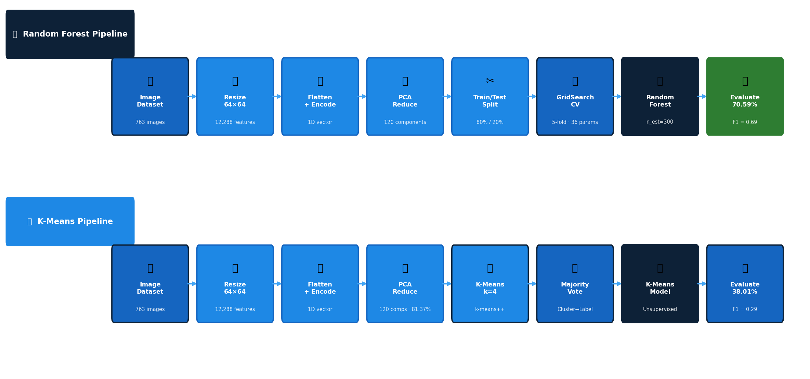
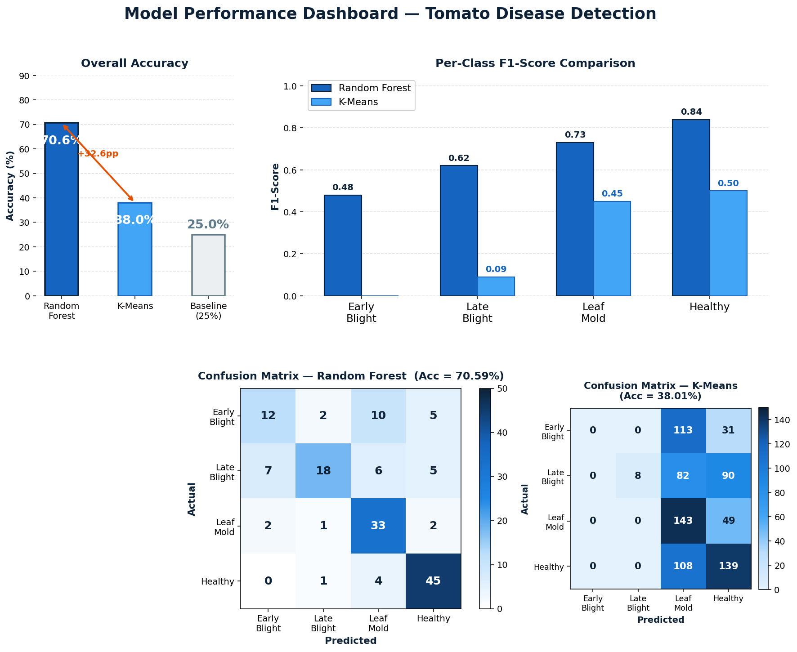
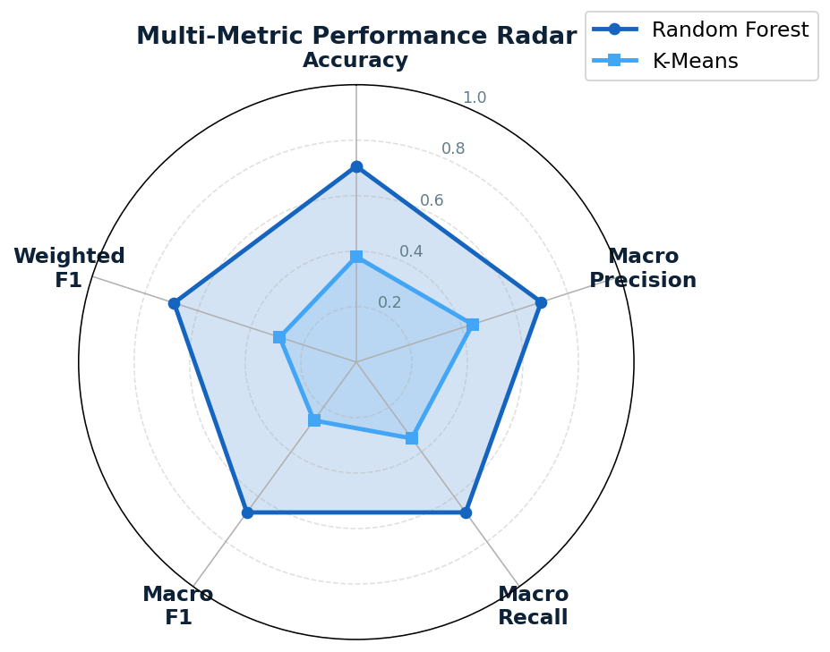
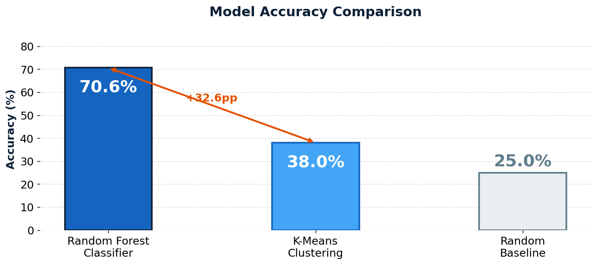
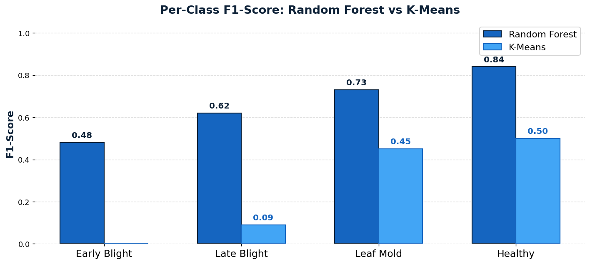
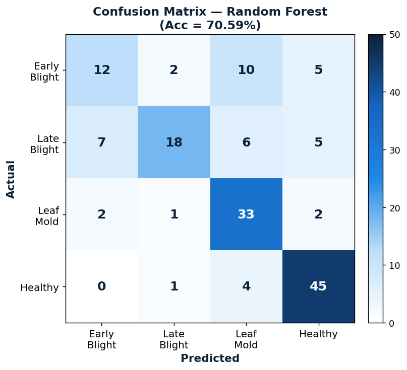
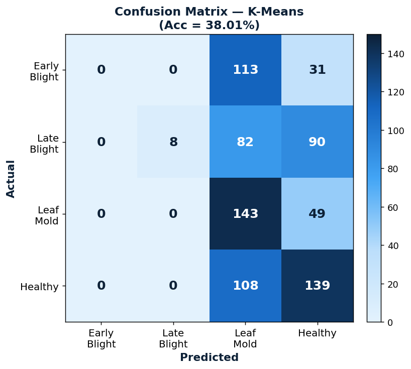

<div align="center">

# 🍅 Tomato Leaf Disease Detection

### A Comparative Study: Supervised vs Unsupervised Machine Learning

<!-- Core tech badges -->
[](https://python.org)
[](https://scikit-learn.org)
[](https://opencv.org)
[](https://jupyter.org)
[](LICENSE)

<!-- Repo quality badges -->
[](https://github.com/your-username/tomato-disease-detection)
[](https://peps.python.org/pep-0008/)
[](notebooks/)
[](src/)
[](https://github.com/your-username/tomato-disease-detection/pulls)
[](docs/dataset.md)
[](docs/dataset.md)
[-success?style=flat-square)](#-reproducibility)

<br/>

> Automated detection of tomato leaf diseases using classical Machine Learning.
> Implements and rigorously compares a **Random Forest Classifier** (supervised) against
> **K-Means Clustering** (unsupervised), both augmented with PCA dimensionality reduction.

<br/>

| 🌲 Random Forest | ⭕ K-Means + PCA | 📁 Dataset |
|:---:|:---:|:---:|
| **70.59%** Accuracy | **38.01%** Accuracy | **763** Images |
| Weighted F1: **0.69** | Weighted F1: **0.29** | **4** Disease Classes |
| GridSearchCV Tuned | k-means++ Init | 81.37% PCA Variance |

</div>

---

## 📋 Table of Contents

- [Project Motivation](#-project-motivation)
- [Key Results](#-key-results)
- [Project Demo](#-project-demo)
- [Overview](#-overview)
- [Model Pipeline Diagram](#-model-pipeline-diagram)
- [Model Performance Visualization](#-model-performance-visualization)
- [Results at a Glance](#-results-at-a-glance)
- [Repository Structure](#-repository-structure)
- [Dataset](#-dataset)
- [Algorithms](#-algorithms)
- [Installation](#-installation)
- [Usage](#-usage)
- [Example Code Snippets](#-example-code-snippets)
- [Results Deep Dive](#-results-deep-dive)
- [Comparative Analysis](#-comparative-analysis)
- [Reproducibility](#-reproducibility)
- [Key Learnings](#-key-learnings)
- [Future Work](#-future-work)
- [Tech Stack](#-tech-stack)
- [Author](#-author)
- [References](#-references)

---

## 🌱 Project Motivation

Every year, **tomato crop diseases cause billions of dollars in agricultural losses** globally. Farmers — especially smallholders in developing regions — often lack access to trained agronomists who can diagnose leaf diseases early enough to act. By the time visible symptoms appear and an expert is consulted, the damage is already spreading.

This project was built to explore a simple but important question:

> **Can machine learning automate disease detection from a photo of a leaf — and how much does it matter whether we have labelled training data?**

Two approaches are compared head-to-head:

- **Supervised (Random Forest):** Assumes you have labelled images — realistic for research labs and funded programs
- **Unsupervised (K-Means):** Assumes zero labelling — realistic for small farms or resource-constrained settings

The 32.6 percentage-point accuracy gap between them is not just a number — it **concretely quantifies the cost of not investing in data annotation**, a trade-off every AI practitioner faces in the real world.

This project was also a personal benchmark: as a second-year AI/ML student, I wanted to go beyond tutorial-level ML and build something that follows a rigorous experimental structure — controlled preprocessing, hyperparameter tuning, proper evaluation, and honest comparison of failure modes.

---

## 🏆 Key Results

> **The single most important takeaways from this project — at a glance.**

```
┌─────────────────────────────────────────────────────────────────────┐
│                      KEY RESULTS SUMMARY                            │
├─────────────────────────┬───────────────────────────────────────────┤
│  🌲 Random Forest       │  70.59% accuracy  |  Weighted F1 = 0.69  │
│  ⭕ K-Means Clustering  │  38.01% accuracy  |  Weighted F1 = 0.29  │
│  📊 Random Baseline     │  25.00% accuracy  |  (4-class chance)    │
├─────────────────────────┴───────────────────────────────────────────┤
│  🔑 Supervised vs Unsupervised Gap  →  +32.6 percentage points      │
│  📉 PCA Variance Retained           →  81.37% (120 components)      │
│  🏅 Best Class (RF)                 →  Healthy — F1 = 0.84          │
│  ⚠️  Hardest Class (both models)    →  Early Blight (visually ambig)│
│  🔍 GridSearchCV Gain               →  ~60% → 70.59% (+10pp)        │
│  ❌ K-Means Failure                 →  Early Blight — F1 = 0.00     │
└─────────────────────────────────────────────────────────────────────┘
```

**Bottom line:** When labelled data is available, supervised learning is non-negotiable for image classification. K-Means (38%) barely outperforms random guessing (25%), while a properly tuned Random Forest reaches 70.59% — a **2.8× improvement** over the unsupervised baseline.

---

## 🎬 Project Demo

### What the system does

Upload any tomato leaf image → the model returns the predicted disease category with confidence.

```
Input:  tomato_leaf.jpg
Output: Predicted Disease Category: Tomato_Healthy  ✅
```

```
Input:  diseased_leaf.jpg
Output: Predicted Disease Category: Tomato_Late_blight  ⚠️
```

### Prediction output (Random Forest)

```python
>>> from src.predict import predict_rf
>>> from src.train_model import train

>>> model, le, pca = train()
[train] Train size: 610  |  Test size: 153
[train] Best parameters: {'max_depth': 20, 'n_estimators': 300, ...}
[train] Test Accuracy : 70.59%

>>> predict_rf("tomato_leaf.jpg", model, pca, le)
[RF]  Predicted : Tomato_healthy  (84.3% confidence)
'Tomato_healthy'
```

### Prediction output (K-Means)

```python
>>> from src.predict import predict_kmeans
>>> from src.kmeans_model import train_kmeans

>>> kmeans, pca, le, cluster_map = train_kmeans()
[kmeans] Cluster 0 → Tomato_Leaf_Mold
[kmeans] Cluster 1 → Tomato_healthy
[kmeans] Cluster 2 → Tomato_Late_blight
[kmeans] Clustering Accuracy : 38.01%

>>> predict_kmeans("tomato_leaf.jpg", kmeans, pca, le, cluster_map)
[KMeans] Predicted : Tomato_healthy  (Cluster 1)
'Tomato_healthy'
```

### Run it yourself in 3 steps

```bash
# 1. Clone & install
git clone https://github.com/your-username/tomato-disease-detection.git
pip install -r requirements.txt

# 2. Add your dataset to dataset/

# 3. Predict
python src/predict.py --image your_leaf.jpg --model rf
```

---

## 🔍 Overview

| | Approach | Algorithm | Labels Required |
|---|---|---|:---:|
| **Model A** | Supervised Learning | Random Forest + GridSearchCV | ✅ Yes |
| **Model B** | Unsupervised Learning | K-Means + PCA | ❌ No |

Both models share an **identical preprocessing pipeline** (resize → RGB → flatten → PCA) to isolate the algorithmic difference. GridSearchCV with 5-fold cross-validation was used to tune the Random Forest across 36 hyperparameter combinations.

---

## 🔀 Model Pipeline Diagram

<div align="center">

<br/><em>Figure 1: End-to-end pipeline for both models — highlighted boxes are the core algorithm steps</em>
</div>

<br/>

**Shared preprocessing steps (identical for both models):**

| Step | Operation | Output |
|---|---|---|
| 1 | Load images via OpenCV | Raw BGR arrays |
| 2 | Resize to 64×64 pixels | Uniform spatial resolution |
| 3 | Convert BGR → RGB | Correct colour space |
| 4 | Flatten to 1D vector | 12,288 features per image |
| 5 | Label encode | Integer class IDs (0–3) |
| 6 | Apply PCA | 120 components, 81.37% variance |

**From here the pipelines diverge:**
- 🌲 **Random Forest** → stratified train/test split → GridSearchCV → supervised classification
- ⭕ **K-Means** → fit on full dataset → majority-vote cluster labelling → evaluate

---

## 📊 Model Performance Visualization

<div align="center">

<br/><em>Figure 2: Full performance dashboard — accuracy, per-class F1, and confusion matrices</em>
</div>

<br/>

<div align="center">

<br/><em>Figure 3: Multi-metric radar chart — Random Forest dominates all five predictive metrics</em>
</div>

---

## 📈 Results at a Glance

<div align="center">

<br/><em>Figure 4: Overall accuracy — Random Forest vs K-Means vs 25% random baseline</em>
</div>

<br/>

<div align="center">

<br/><em>Figure 5: Per-class F1-score across all four disease categories</em>
</div>

<br/>

| Metric | 🌲 Random Forest | ⭕ K-Means |
|---|:---:|:---:|
| **Overall Accuracy** | **70.59%** | 38.01% |
| Macro Avg Precision | 0.70 | 0.44 |
| Macro Avg Recall | 0.67 | 0.34 |
| **Macro Avg F1** | **0.67** | 0.26 |
| **Weighted Avg F1** | **0.69** | 0.29 |
| Best Class (F1) | Healthy: **0.84** | Healthy: 0.50 |
| Weakest Class (F1) | Early Blight: 0.48 | Early Blight: 0.00 |

---

## 📁 Repository Structure

```
tomato-disease-detection/
│
├── 📓 notebooks/
│   ├── random_forest_model.ipynb      # Supervised RF — full training & evaluation
│   └── kmeans_model.ipynb             # Unsupervised K-Means — clustering & evaluation
│
├── 🐍 src/
│   ├── preprocess.py                  # Image loading, resizing, PCA pipeline
│   ├── train_model.py                 # Random Forest training + GridSearchCV
│   ├── kmeans_model.py                # K-Means clustering + majority-vote mapping
│   ├── predict.py                     # CLI inference for both models
│   └── evaluate.py                    # Confusion matrix, classification report, plots
│
├── 📄 docs/
│   ├── dataset.md                     # Full dataset documentation & class details
│   └── images/                        # README figures and charts
│
├── 📄 .gitignore
├── 📄 requirements.txt
└── 📄 README.md
```

> **Note:** The `dataset/` folder is excluded via `.gitignore`. See [docs/dataset.md](docs/dataset.md) for setup instructions.

---

## 🗂️ Dataset

The dataset consists of **763 tomato leaf images** across 4 labelled classes:

| Disease Class | Images | Share | Pathogen |
|---|:---:|:---:|---|
| 🟤 Tomato Early Blight | 144 | 18.9% | *Alternaria solani* |
| 💧 Tomato Late Blight | 180 | 23.6% | *Phytophthora infestans* |
| 🟡 Tomato Leaf Mold | 192 | 25.2% | *Passalora fulva* |
| 🌿 Tomato Healthy | 247 | 32.4% | — |
| | **763** | **100%** | |

📖 Full dataset documentation: [docs/dataset.md](docs/dataset.md)

---

## 🤖 Algorithms

### 🌲 Model A — Random Forest (Supervised)

Random Forest builds an ensemble of decision trees, each trained on a bootstrapped data subset. Final predictions use majority voting. Highly robust to overfitting on high-dimensional pixel inputs.

**Optimal hyperparameters (GridSearchCV, 5-fold CV, 36 combinations):**

```python
RandomForestClassifier(
    n_estimators=300,
    max_depth=20,
    min_samples_leaf=1,
    min_samples_split=2,
    random_state=42
)
```

### ⭕ Model B — K-Means Clustering (Unsupervised)

K-Means partitions data into k clusters by minimising intra-cluster Euclidean distance — operating **entirely without labels**. PCA compresses 12,288D to 120 components retaining **81.37% of variance** before clustering.

```python
KMeans(
    n_clusters=4,       # = number of disease classes
    init='k-means++',   # smart centroid initialisation
    n_init=10,          # best result of 10 random seeds
    max_iter=300,
    random_state=42
)
```

---

## ⚙️ Installation

**1. Clone the repo**
```bash
git clone https://github.com/your-username/tomato-disease-detection.git
cd tomato-disease-detection
```

**2. Install dependencies**
```bash
pip install -r requirements.txt
```

**3. Set up the dataset**

```
dataset/
├── Tomato_Early_blight/
├── Tomato_Late_blight/
├── Tomato_Leaf_Mold/
└── Tomato_healthy/
```

---

## 🚀 Usage

### Run via Jupyter Notebooks

```bash
jupyter notebook notebooks/random_forest_model.ipynb
jupyter notebook notebooks/kmeans_model.ipynb
```

### Run via Python Scripts

```bash
python src/train_model.py                                  # Train RF
python src/kmeans_model.py                                 # Train K-Means
python src/predict.py --image path/to/leaf.jpg --model rf  # Predict RF
python src/predict.py --image path/to/leaf.jpg --model kmeans  # Predict KM
```

---

## 💻 Example Code Snippets

### 1. Load and preprocess the dataset

```python
from src.preprocess import load_dataset, apply_pca

# Load all images from class-labelled folders
data, labels, labels_encoded, le, label_names = load_dataset("dataset/")
# Output: Loaded 763 images from 4 classes
# Feature vector size: 12288D

# Apply PCA dimensionality reduction
data_pca, pca = apply_pca(data, n_components=120)
# Output: Variance retained: 81.37% with 120 components
```

---

### 2. Train the Random Forest with GridSearchCV

```python
from sklearn.ensemble import RandomForestClassifier
from sklearn.model_selection import train_test_split, GridSearchCV

# Stratified train/test split
X_train, X_test, y_train, y_test = train_test_split(
    data_pca, labels_encoded,
    test_size=0.20,
    stratify=labels_encoded,
    random_state=42
)

# Hyperparameter grid — 36 combinations × 5 folds = 180 fits
param_grid = {
    "n_estimators":      [50, 100, 200, 300],
    "max_depth":         [None, 10, 20],
    "min_samples_leaf":  [1, 2],
    "min_samples_split": [2, 5],
}

rf = RandomForestClassifier(random_state=42)
grid_search = GridSearchCV(rf, param_grid, cv=5, scoring="accuracy", n_jobs=-1)
grid_search.fit(X_train[:500], y_train[:500])

best_model = grid_search.best_estimator_
print(f"Best params : {grid_search.best_params_}")
# Best params : {'max_depth': 20, 'min_samples_split': 2, 'n_estimators': 300, ...}

y_pred = best_model.predict(X_test)
print(f"Test Accuracy : {accuracy_score(y_test, y_pred)*100:.2f}%")
# Test Accuracy : 70.59%
```

---

### 3. Train K-Means and map clusters to disease labels

```python
from sklearn.cluster import KMeans
from scipy.stats import mode
import numpy as np

# Fit K-Means on the full PCA-reduced dataset (no split needed)
kmeans = KMeans(n_clusters=4, init='k-means++', n_init=10,
                max_iter=300, random_state=42)
cluster_labels = kmeans.fit_predict(data_pca)

# Map each cluster to its majority true label (post-hoc assignment)
cluster_to_label = {}
for cluster_id in range(4):
    mask = cluster_labels == cluster_id
    true_labels_in_cluster = labels_encoded[mask]
    most_common = mode(true_labels_in_cluster, keepdims=True).mode[0]
    cluster_to_label[cluster_id] = most_common

# Decode and display the mapping
for cid, lid in cluster_to_label.items():
    print(f"  Cluster {cid} → {le.inverse_transform([lid])[0]}")
# Cluster 0 → Tomato_Leaf_Mold
# Cluster 1 → Tomato_healthy
# Cluster 2 → Tomato_Late_blight
# Cluster 3 → Tomato_Leaf_Mold
```

---

### 4. Predict on a new unseen image

```python
import cv2
import numpy as np

def predict_disease(image_path, model, pca, le, image_size=(64, 64)):
    """
    Full inference pipeline: raw image → disease prediction.
    Works for both Random Forest and K-Means (pass kmeans as model).
    """
    # Load and preprocess
    img = cv2.imread(image_path)
    img = cv2.resize(img, image_size)
    img = cv2.cvtColor(img, cv2.COLOR_BGR2RGB)
    img_flat = img.flatten().reshape(1, -1)       # (1, 12288)

    # Reduce dimensions
    img_pca = pca.transform(img_flat)             # (1, 120)

    # Predict
    pred = model.predict(img_pca)[0]
    label = le.inverse_transform([pred])[0]
    return label

# Example usage
result = predict_disease("my_leaf.jpg", best_model, pca, le)
print(f"Predicted Disease: {result}")
# Predicted Disease: Tomato_healthy
```

---

## 📉 Results Deep Dive

### Random Forest — Confusion Matrix

<div align="center">

<br/><em>Figure 6: RF confusion matrix — Test Set (n=153, Acc=70.59%)</em>
</div>

| Class | Precision | Recall | F1 | Support |
|---|:---:|:---:|:---:|:---:|
| Tomato Early Blight | 0.57 | 0.41 | 0.48 | 29 |
| Tomato Late Blight | **0.82** | 0.50 | 0.62 | 36 |
| Tomato Leaf Mold | 0.62 | **0.87** | 0.73 | 38 |
| Tomato Healthy | 0.79 | **0.90** | **0.84** | 50 |
| **Weighted Avg** | 0.71 | 0.71 | **0.69** | 153 |

### K-Means — Confusion Matrix

<div align="center">

<br/><em>Figure 7: K-Means confusion matrix — Full Dataset (n=763, Acc=38.01%)</em>
</div>

| Class | Precision | Recall | F1 | Support |
|---|:---:|:---:|:---:|:---:|
| Tomato Early Blight | 0.00 | 0.00 | **0.00** | 144 |
| Tomato Late Blight | **1.00** | 0.04 | 0.09 | 180 |
| Tomato Leaf Mold | 0.32 | 0.74 | 0.45 | 192 |
| Tomato Healthy | 0.45 | 0.56 | 0.50 | 247 |
| **Weighted Avg** | 0.46 | 0.38 | **0.29** | 763 |

---

## ⚖️ Comparative Analysis

| Criterion | 🌲 Random Forest | ⭕ K-Means + PCA |
|---|---|---|
| Learning Paradigm | Supervised | Unsupervised |
| **Overall Accuracy** | **70.59%** | 38.01% |
| **Weighted F1** | **0.69** | 0.29 |
| Requires Labels? | ✅ Yes | ❌ No |
| Hyperparameter Tuning | GridSearchCV (5-fold) | k, n_init, PCA components |
| Feature Dimensionality | 12,288 (raw pixels) | 120 PCA components |
| Training Speed | Moderate | Fast |
| Scalability | Moderate | High |
| Best Use Case | Labelled production system | Exploratory / label-scarce |

### Why the 32.6pp Gap?

1. **Label supervision** — RF optimises class boundaries directly; K-Means minimises geometric distance with no concept of disease categories
2. **Feature relevance** — RF implicitly weights discriminative pixels via Gini importance; K-Means treats all 120 PCA dimensions equally
3. **Non-spherical boundaries** — disease clusters are irregular and overlapping in PCA space, violating K-Means' core geometric assumption

---

## 🔁 Reproducibility

All experiments are **fully reproducible**. Every stochastic component uses `random_state=42`:

```python
PCA(n_components=120, random_state=42)
train_test_split(..., random_state=42, stratify=labels_encoded)
RandomForestClassifier(random_state=42)
KMeans(n_clusters=4, init='k-means++', n_init=10, random_state=42)
```

| Step | Detail | Reproducible? |
|---|---|:---:|
| Dataset loading | `sorted(os.listdir())` — deterministic order | ✅ |
| PCA | Fixed `random_state=42` | ✅ |
| Train/test split | Stratified, `random_state=42` | ✅ |
| GridSearchCV | Fixed `random_state=42` on estimator | ✅ |
| K-Means | Fixed `random_state=42`, `n_init=10` | ✅ |

> **Expected outputs:** RF Accuracy = **70.59%** | K-Means Accuracy = **38.01%** | PCA Variance = **81.37%**

Install the exact environment:
```bash
pip install -r requirements.txt
```

---

## 💡 Key Learnings

```python
# 1. PCA is essential for K-Means on image data
#    Without PCA → curse of dimensionality → all clusters collapse
#    With PCA (120 comps) → 81.37% variance retained, structure preserved

# 2. Supervised >> Unsupervised when labels exist
#    RF: 70.59%  |  K-Means: 38.01%  |  Random baseline: 25%
#    K-Means barely beats random — labels matter enormously

# 3. Cluster-class mismatch is a predictable failure mode
#    Two clusters → Leaf Mold  |  Zero clusters → Early Blight
#    Confirms non-spherical class geometry in raw pixel space

# 4. GridSearchCV pays off significantly
#    Default RF: ~60%  |  Tuned RF: 70.59%  →  +10pp from tuning alone
```

---

## 🔭 Future Work

| Direction | Expected Impact |
|---|---|
| 🧠 CNN / Deep Learning | >90% accuracy via learnt spatial features |
| 🔄 Transfer Learning (ResNet-50, EfficientNet) | >85% with small dataset |
| 📈 Data Augmentation (flip, rotate, jitter) | Better generalisation |
| 🔀 Semi-supervised (K-Means pseudo-labels → RF) | Reduced labelling cost |
| 📊 Gaussian Mixture Models | Better unsupervised clustering |
| 🌐 FastAPI Web Deployment | Upload image → instant prediction |
| 🔍 LIME / SHAP Explainability | Disease region heatmaps |

---

## 🛠️ Tech Stack

| Category | Tool | Version |
|---|---|---|
| Language | Python | 3.14 |
| Image Processing | OpenCV | 4.13.0 |
| ML Framework | scikit-learn | 1.8.0 |
| Numerics | NumPy | 2.4.3 |
| Data Analysis | Pandas | 3.0.1 |
| Visualisation | Matplotlib + Seaborn | 3.10 + 0.13.2 |
| Statistics | SciPy | 1.17.1 |
| Notebook | Jupyter | — |

---

## 👨‍💻 Author

<div align="center">

**Karan**
B.Tech — Artificial Intelligence & Machine Learning
Manipal University Jaipur, Rajasthan
Academic Year: 2025–26

[](https://linkedin.com/in/your-profile)
[](https://github.com/your-username)

</div>

---

## 📚 References

1. Hughes, D. P., & Salathé, M. (2015). An open access repository of images on plant health. *arXiv:1511.08060*
2. Breiman, L. (2001). Random forests. *Machine Learning, 45*(1), 5–32.
3. MacQueen, J. B. (1967). Some methods for classification of multivariate observations. *5th Berkeley Symposium*, 281–297.
4. Pedregosa, F., et al. (2011). Scikit-learn: Machine learning in Python. *JMLR, 12*, 2825–2830.
5. Jolliffe, I. T. (2002). *Principal Component Analysis* (2nd ed.). Springer.
6. Bradski, G. (2000). The OpenCV Library. *Dr. Dobb's Journal*.

---

<div align="center">

⭐ **If this project helped you, please give it a star!**

*Made with 🍅 and Python — Manipal University Jaipur, 2025–26*

</div>
